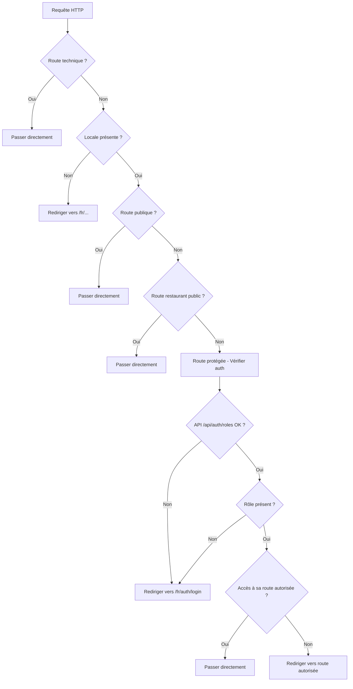

# 🔐 Guide du Middleware d'Authentification

## 📋 Vue d'Ensemble

Le middleware d'authentification gère la sécurité et les redirections de l'application SaaS multi-tenant. Il s'applique à toutes les routes et détermine l'accès selon le statut d'authentification et les rôles utilisateur.

## 🏗️ Architecture du Middleware

### **Fichiers Principaux**

- **`src/middleware.ts`** : Point d'entrée principal
- **`src/middleware/auth-middleware.ts`** : Logique d'authentification
- **`src/app/api/auth/roles/route.ts`** : API de récupération des rôles

### **Flux de Traitement**



## 🔐 Types de Routes

### **1. Routes Techniques (Exclues)**

```typescript
const EXCLUDED_ROUTES = [
  "/favicon.ico",
  "/robots.txt",
  "/sitemap.xml",
  "/manifest.json",
  "/api",
  "/_next",
  "/_vercel",
  "/trpc",
];
```

**Comportement :** ✅ **Accès direct** - Pas de vérification

### **2. Routes Publiques (Auth)**

```typescript
const PUBLIC_ROUTES = [
  "/",
  "/auth/login",
  "/auth/register",
  "/auth/forgot-password",
  "/auth/reset-password",
  "/auth/logout",
];
```

**Comportement :** ✅ **Accès direct** - Pas d'authentification requise

### **3. Routes Restaurants Publics**

```typescript
// Format : /[slug] ou /[slug]/[page]
// Exemples : /fr/restaurant-lyon, /fr/restaurant-lyon/menu
```

**Détection :**

```typescript
function isRestaurantPublicRoute(pathname: string): boolean {
  const routeWithoutLocale = pathname.replace(/^\/[a-z]{2}\//, "/");

  // Exclure les routes protégées
  if (
    routeWithoutLocale.startsWith("/admin/") ||
    routeWithoutLocale.startsWith("/dashboard/") ||
    routeWithoutLocale.startsWith("/auth/")
  ) {
    return false;
  }

  // Format : /[slug] ou /[slug]/[page]
  return /^\/[^\/]+$/.test(routeWithoutLocale) || /^\/[^\/]+\//.test(routeWithoutLocale);
}
```

**Comportement :** ✅ **Accès direct** - Pas d'authentification requise

### **4. Routes Protégées**

```typescript
// Toutes les autres routes : /dashboard, /admin, etc.
```

**Comportement :** 🔒 **Authentification + Rôle requis**

## 👥 Logique par Rôle

### **🔴 Utilisateur Déconnecté**

| Route                 | Comportement              |
| --------------------- | ------------------------- |
| `/fr/restaurant-lyon` | ✅ **Accès direct**       |
| `/fr/auth/login`      | ✅ **Accès direct**       |
| `/fr/dashboard`       | ❌ **→ `/fr/auth/login`** |
| `/fr/admin`           | ❌ **→ `/fr/auth/login`** |

### **🟡 Org Admin (`org_admin`)**

| Route                          | Comportement             |
| ------------------------------ | ------------------------ |
| `/fr/restaurant-lyon`          | ✅ **Accès direct**      |
| `/fr/dashboard`                | ✅ **Accès autorisé**    |
| `/fr/admin`                    | ❌ **→ `/fr/dashboard`** |
| `/fr/dashboard/establishments` | ✅ **Accès autorisé**    |

### **🟢 System Admin (`system_admin`)**

| Route                     | Comportement          |
| ------------------------- | --------------------- |
| `/fr/restaurant-lyon`     | ✅ **Accès direct**   |
| `/fr/admin`               | ✅ **Accès autorisé** |
| `/fr/dashboard`           | ❌ **→ `/fr/admin`**  |
| `/fr/admin/organizations` | ✅ **Accès autorisé** |

## 🔄 Redirections Automatiques

### **1. Locale Manquante**

```typescript
// /dashboard → /fr/dashboard
// /admin → /fr/admin
```

### **2. Locale Non Supportée**

```typescript
// /de/dashboard → /fr/dashboard
// /it/admin → /fr/admin
```

### **3. Authentification Requise**

```typescript
// Utilisateur déconnecté sur /fr/dashboard → /fr/auth/login
// Utilisateur déconnecté sur /fr/admin → /fr/auth/login
```

### **4. Rôle Inapproprié**

```typescript
// org_admin sur /fr/admin → /fr/dashboard
// system_admin sur /fr/dashboard → /fr/admin
```

## ⚡ API d'Authentification

### **Endpoint : `/api/auth/roles`**

```typescript
// Méthode : GET
// Headers : Cookie (session)
// Réponse : { role: "org_admin" | "system_admin" | null }
```

### **Logique de Récupération**

```typescript
export async function GET() {
  const supabase = await createClient();
  const {
    data: { user },
  } = await supabase.auth.getUser();

  if (!user) {
    return NextResponse.json({ role: null });
  }

  // Vérifier system_admin via métadonnées
  const systemRole = user.app_metadata?.role || user.user_metadata?.role;

  if (systemRole === "system_admin") {
    return NextResponse.json({ role: "system_admin" });
  }

  // Vérifier org_admin via users_organizations
  const { data: orgRole } = await supabase
    .from("users_organizations")
    .select("organization_id")
    .eq("user_id", user.id)
    .eq("deleted", false)
    .single();

  if (orgRole) {
    return NextResponse.json({ role: "org_admin" });
  }

  return NextResponse.json({ role: null });
}
```

### **Gestion des Erreurs**

```typescript
if (!response.ok) {
  // API inaccessible → Rediriger vers login
  return NextResponse.redirect(new URL(`/${locale}/auth/login`, req.url));
}

if (!roleData.role) {
  // Pas de rôle → Rediriger vers login
  return NextResponse.redirect(new URL(`/${locale}/auth/login`, req.url));
}
```

## 🛡️ Sécurité et Permissions

### **Règles de Sécurité**

1. **🔒 Principe du moindre privilège** - Chaque rôle n'accède qu'à ses routes autorisées
2. **🛡️ Défense en profondeur** - Vérification côté middleware ET côté composants
3. **🔄 Redirection automatique** - L'utilisateur est toujours dirigé vers sa zone autorisée
4. **🌐 Sites publics accessibles** - Les restaurants restent accessibles à tous
5. **🔍 Logs d'erreur** - Traçabilité des problèmes d'authentification

### **Vérification des Permissions**

```typescript
// Déterminer la route autorisée selon le rôle
function getAuthorizedRoute(userRole: string): string {
  switch (userRole) {
    case "system_admin":
      return "/admin";
    case "org_admin":
      return "/dashboard";
    default:
      return "/auth/login";
  }
}

// Vérifier si l'utilisateur accède à sa route autorisée
if (pathname.includes(authorizedRoute)) {
  return NextResponse.next();
}

// Rediriger vers la route autorisée
return NextResponse.redirect(new URL(`/${locale}${authorizedRoute}`, req.url));
```

## 🎯 Résumé des Zones d'Accès

| Zone              | Déconnecté | Org Admin | System Admin |
| ----------------- | ---------- | --------- | ------------ |
| **Sites Publics** | ✅         | ✅        | ✅           |
| **Auth Pages**    | ✅         | ✅        | ✅           |
| **Dashboard**     | ❌         | ✅        | ❌           |
| **Admin**         | ❌         | ❌        | ✅           |

## 🔧 Configuration et Maintenance

### **Variables d'Environnement**

```env
# Supabase
NEXT_PUBLIC_SUPABASE_URL=your_supabase_url
NEXT_PUBLIC_SUPABASE_ANON_KEY=your_anon_key
SUPABASE_SERVICE_ROLE_KEY=your_service_role_key

# Internationalisation
NEXT_PUBLIC_DEFAULT_LOCALE=fr
```

### **Logs et Debugging**

```typescript
// Ajouter des logs pour le debugging
console.error("Middleware auth error:", error);

// Vérifier les cookies de session
const cookieLocale = req.cookies.get("NEXT_LOCALE")?.value;
```

### **Tests du Middleware**

1. **Test utilisateur déconnecté** : Accès aux routes protégées
2. **Test org_admin** : Accès au dashboard et redirection depuis admin
3. **Test system_admin** : Accès à admin et redirection depuis dashboard
4. **Test sites publics** : Accès aux restaurants sans authentification
5. **Test locales** : Redirection automatique vers la locale par défaut

## 🚨 Points de Vigilance

### **1. Gestion des Sessions**

- Vérifier que les cookies de session sont correctement transmis
- Gérer les cas d'expiration de session
- Rediriger vers login en cas de session invalide

### **2. Performance**

- Le middleware s'exécute sur chaque requête
- Optimiser les appels à l'API `/api/auth/roles`
- Utiliser le cache approprié pour les vérifications de rôles

### **3. Sécurité**

- Ne jamais exposer les clés de service côté client
- Valider toutes les entrées utilisateur
- Utiliser HTTPS en production
- Implémenter une protection CSRF si nécessaire

### **4. Internationalisation**

- Gérer correctement les locales non supportées
- Maintenir la cohérence des redirections avec les locales
- Tester avec différentes langues

## 📝 Exemples d'Usage

### **Ajouter une Nouvelle Route Publique**

```typescript
const PUBLIC_ROUTES = [
  "/",
  "/auth/login",
  "/auth/register",
  "/auth/forgot-password",
  "/auth/reset-password",
  "/auth/logout",
  "/new-public-route", // Ajouter ici
];
```

### **Modifier la Logique de Rôles**

```typescript
function getAuthorizedRoute(userRole: string): string {
  switch (userRole) {
    case "system_admin":
      return "/admin";
    case "org_admin":
      return "/dashboard";
    case "new_role": // Ajouter un nouveau rôle
      return "/new-dashboard";
    default:
      return "/auth/login";
  }
}
```

### **Ajouter des Logs de Debug**

```typescript
export async function authMiddleware(req: NextRequest) {
  const { pathname } = req.nextUrl;

  console.log(`[Middleware] Processing: ${pathname}`);

  // ... logique existante

  console.log(`[Middleware] User role: ${roleData.role}`);
  console.log(`[Middleware] Redirecting to: /${locale}${authorizedRoute}`);
}
```

Cette architecture garantit une séparation claire des accès et une expérience utilisateur cohérente ! 🎉
